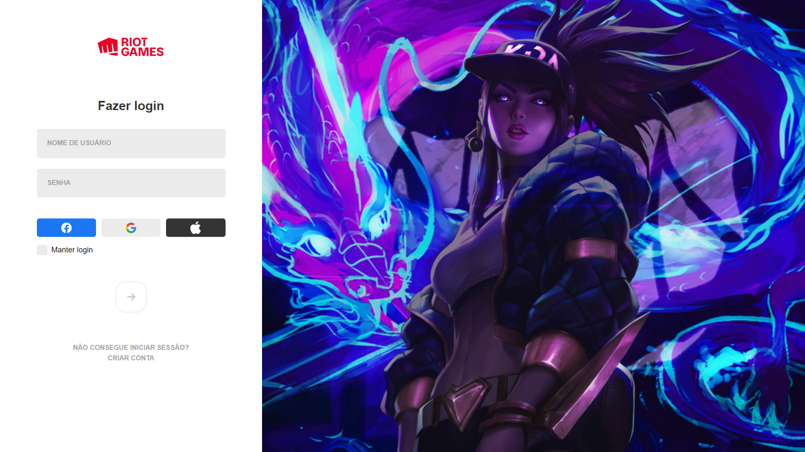

## Sumário

- [Visão geral](#visão-geral)
  - [O objetivo](#O-objetivo)
  - [Screenshot](#screenshot)
- [O processo](#O-processo)
  - [Construído com](#Construído-com)
  - [Aprendido](#Aprendido)
  - [Continuações do desenvolvimento](#Continuações-do-desenvolvimento)
  - [Recursos úteis](#Recursos-úteis)
- [Autor](#Autor)


## visão geral

### O objetivo

Realizar uma cópia do Client da empresa Riot Games, focado, principalmente, em sua versão para PC. Ele contempla total alteração da largura da tela, ao passo que gera problemas em função de diferentes tamanhos de telas.
Primeiramente, totais créditos à Riot Games. Esse trabalho é uma réplica de seu sistema, não detendo qualquer conteúdo original. Inclusive, foi feito baseado na aula do canal "Manual do Dev".

### Screenshot




## O processo

### Construído com

- Semantic HTML5 markup
- CSS custom properties
- JavaScript
- Flexbox
- vscode

### Aprendido

Muitos detalhes foram realmente uma construção contínuada. Veja, por exemplo, os gatilhos de mudança de status do botão do submit. No código, vê-se no Script, de tal forma:

```
const valoresAtendidos = () =>
{
  const [username, password] = inputs;

  if (username.value && password.value.length >= 8) {
    button.removeAttribute("disabled");
  } else {
    button.setAttribute("disabled", "");
  }
}

```


### Continuações do desenvolvimento

Os próximos projetos continuarão com desenvolvimento front end, tendo como foco o abastecimento do portfólio. 

### Recursos úteis

- [Flex-box guide](https://css-tricks.com/snippets/css/a-guide-to-flexbox/) - esse guia serve de forma sempre esclarecedora como objeto de consulta. Recomendado e sempre muito utilizado.

## Autor

- github - [Github](https://github.com/RuanVPSantos)
- Frontend Mentor - [@RuanVPSantos](https://www.frontendmentor.io/profile/RuanVPSantos)
